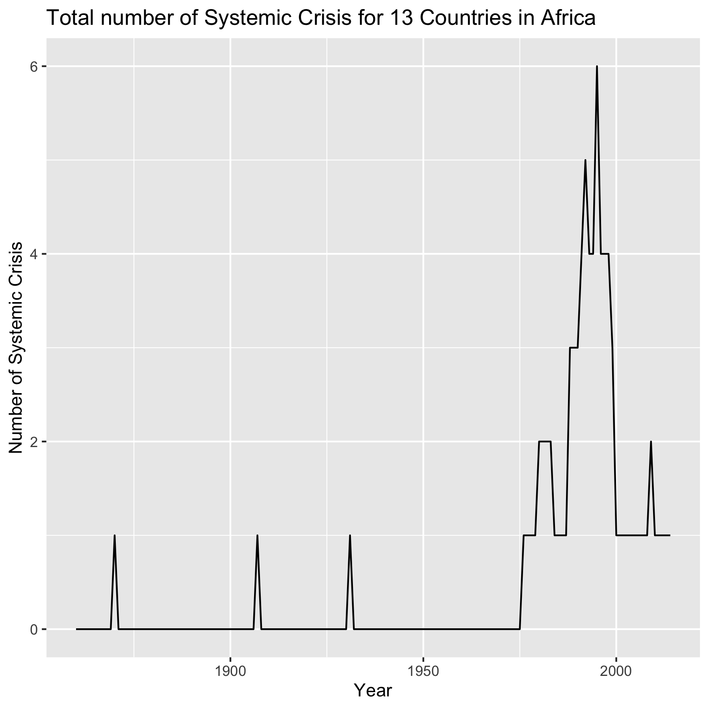
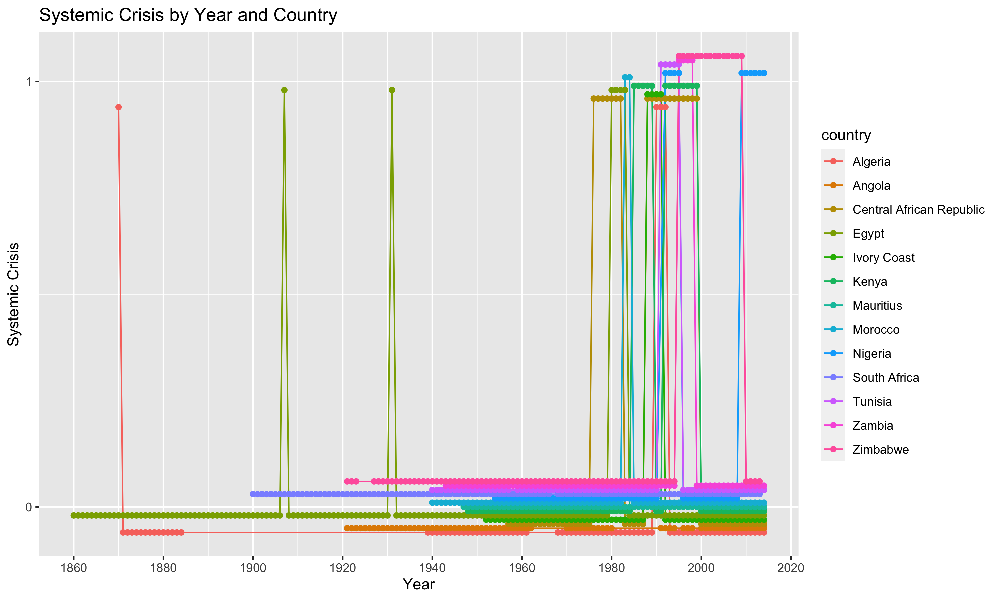
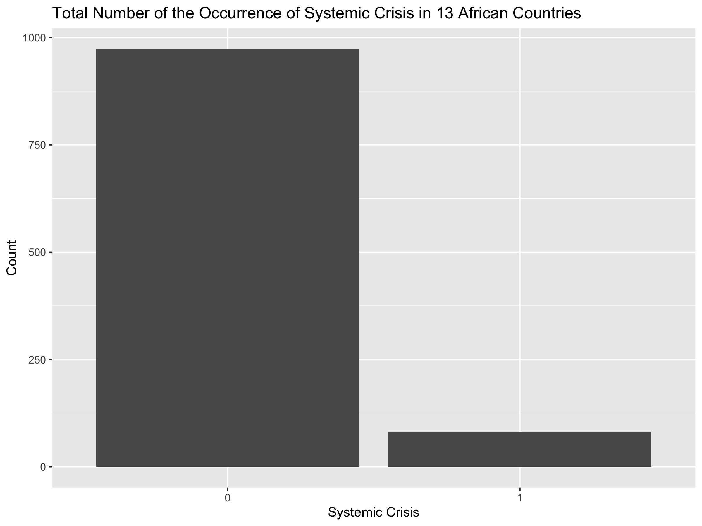
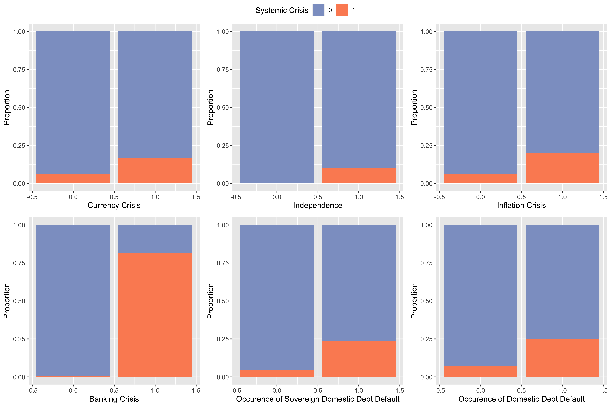
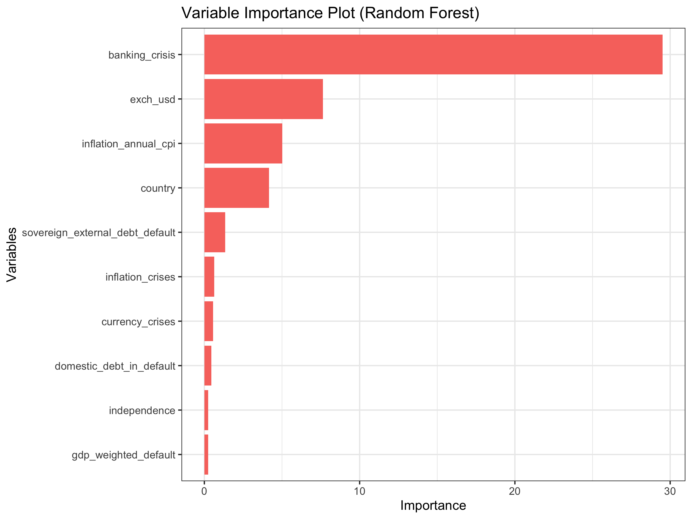
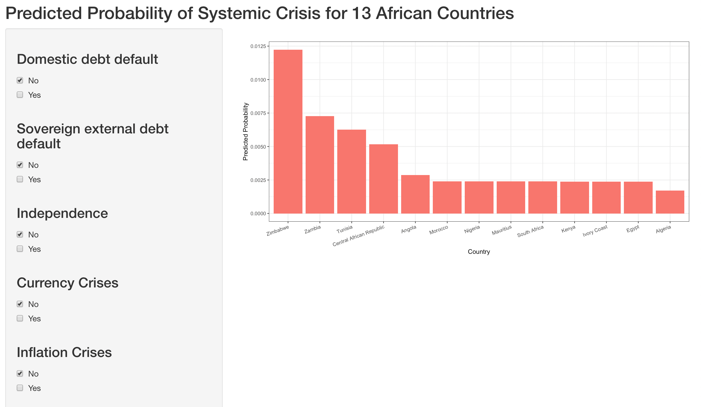

```{r setup, include=FALSE}
knitr::opts_chunk$set(echo = TRUE)
```

# Introduction

Since the last century, African countries have gained independence one after another. In their quest for economic development, some countries have also encountered systemic economic crises during certain years. Studying possible factors that generate systematic crisis is quite important. For developing countries, those study might help policy-makers implement better policies when systematic crisis is about to happen. Besides, studying historical data on Africa economic, banking and systematic crisis may help us predict future crisis.

# Data

## Data Description

In this project, we use data data on economic and financial crises in 13 African countries (1860 to 2014). (It is inspired by <https://www.kaggle.com/datasets/chirin/africa-economic-banking-and-systemic-crisis-data>) This dataset is a derivative of Reinhart et. al's Global Financial Stability dataset which can be found online at: <https://www.hbs.edu/behavioral-finance-and-financial-stability/data/Pages/global.aspx>

The dataset specifically focuses on the Banking, Debt, Financial, Inflation and Systemic Crises that occurred, from 1860 to 2014, in 13 African countries, including: Algeria, Angola, Central African Republic, Ivory Coast, Egypt, Kenya, Mauritius, Morocco, Nigeria, South Africa, Tunisia, Zambia and Zimbabwe.

The data set contains 14 variables:

| Variable Name                   | Meaning                                                                                                                                     |
|-------------------------|-----------------------------------------------|
| case                            | A number which denotes a specific country                                                                                                   |
| cc3                             | A three letter country code                                                                                                                 |
| country                         | The name of the country                                                                                                                     |
| year                            | The year of the observation                                                                                                                 |
| systemetic_crisis               | "0" means that no systemic crisis occurred in the year and "1" means that a systemic crisis occurred in the year.                           |
| exch_usd                        | The exchange rate of the country vis-a-vis the USD                                                                                          |
| domestic_debt_in_default        | "0" means that no sovereign domestic debt default occurred in the year and "1" means that a sovereign domestic debt                         |
| sovereign_external_debt_default | "0" means that no sovereign external debt default occurred in the year and "1" means that a sovereign external debt default occurred in the |
| gdp_weighted_default            | The total debt in default vis-a-vis the GDP                                                                                                 |
| inflation_annual_cpi            | The annual CPI Inflation rate                                                                                                               |
| independence                    | "0" means "no independence" and "1" means "independence"                                                                                    |
| currency_crises                 | "0" means that no currency crisis occurred in the year and "1" means that a currency crisis occurred in the year                            |
| inflation_crises                | "0" means that no inflation crisis occurred in the year and "1" means that an inflation crisis occurred in the year                         |
| banking_crisis                  | "no_crisis" means that no banking crisis occurred in the year and "crisis" means that a banking crisis occurred in the year                 |

## Summary Plots

The response variable we've chosen here is whether a country is experiencing a systemic crisis. Figure 1 and Figure 2 respectively show the total number of systemic crisis for 13 African Countries by year and systemic crisis by year and country.

```{r echo=FALSE, fig.cap="Total Number of Systemic Crisis for 13 African Countries by Year", out.width = '70%', fig.align="center"}

```

```{r echo=FALSE, fig.cap="Systemic Crisis by Year and Country", out.width = '100%', fig.align="center"}

```

\newpage
Figure 3 shows that the response variable systemic crisis is imbalanced in the total number of 0 and 1. Figure 4 shows the correlation plots between the response variable and several categorical explanatory variables.

```{r echo=FALSE, fig.cap="Total Systemic Crisis", out.width = '70%', fig.align="center"}

``` 


```{r echo=FALSE, fig.cap="Correlation Plots", out.width = '90%', fig.align="center"}

``` 


\newpage
# Model

I adopt random forest and GLM (Generalized Linear Model) methods to do the prediction. For GLM method, one include lag variables only, and the other include both lag and current values. (Since y is imbalanced, we split by the value of y separately.) The following table shows the AUC of the three models.

| Method                | AUC    |
| --------------------- | ------ |
| Random Forest         | 98.79% |
| GLM (Lag Only)        | 93.30% |
| GLM (Lag and Current) | 98.79% |

We can tell that the random forest model is a better model since it use less information to get the same AUC as GLM with both lag and current values. The AUC is really high and the precision of the model is really good. We can conclude that this model is adequate. Figure 5 shows the relative variable importance in the random forest model. We can tell that banking crisis is the most important indicator of having a systemic crisis, with the exchange rate of the country vis-a-vis the USD, inflation rate and country following.         

```{r echo=FALSE, fig.cap="Variable Importance in Random Forest", out.width = '90%', fig.align="center"}

```


# Systemic Risk Prediction
I build r


# Acknowledgement

Reinhart, C., Rogoff, K., Trebesch, C. and Reinhart, V. (2019) Global Crises Data by Country. [online] <https://www.hbs.edu/behavioral-finance-and-financial-stability/data>. Available at: <https://www.hbs.edu/behavioral-finance-and-financial-stability/data/Pages/global.aspx> [Accessed: 17 July 2019].
